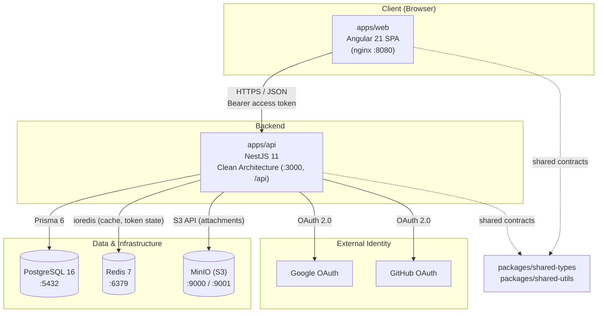
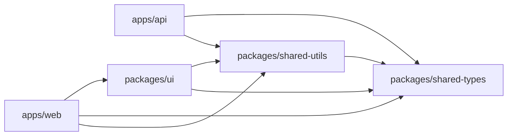
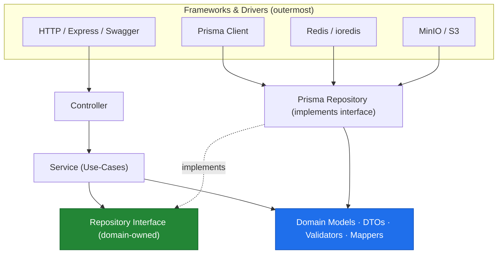
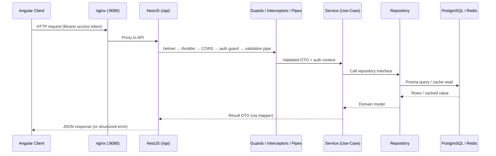

# FinanceHub — Architecture

> System architecture reference for the FinanceHub personal finance management platform.
>
> Related docs: [Development Guide](./development.md) · [Deployment Guide](./deployment.md) · [Contributing](../CONTRIBUTING.md) · [Architecture Decision Records](./adr/README.md)

---

## 1. Overview

FinanceHub is a personal finance management platform delivered as an **Nx 23 integrated monorepo**. It is composed of an Angular single-page application, a NestJS backend built on Clean Architecture, and a set of shared TypeScript packages. All services are containerized and orchestrated locally with Docker Compose.

The design goals are:

- **Strong module boundaries** — enforced statically, so architectural decay is caught in CI, not code review.
- **Framework-agnostic domain logic** — business rules in the API do not depend on NestJS, Prisma, HTTP, or Redis.
- **Shared contracts** — types and enums flow through `@financehub/shared-types` so the web and API never drift.
- **Operational readiness from day one** — health checks, rate limiting, structured error handling, and observability are cross-cutting, not afterthoughts.

### 1.1 Component diagram

---

## 2. Monorepo layout

| Path | Project | Stack | Nx tags | Import path |
|------|---------|-------|---------|-------------|
| `apps/web` | Web app | Angular 21 standalone, SCSS, Angular Material, Signals, RxJS, Reactive Forms | `scope:web,type:app` | — |
| `apps/api` | API app | NestJS 11, Clean Architecture, Webpack build, `@nx/js:node` serve | `scope:api,type:app` | — |
| `apps/web-e2e` | Web E2E | Playwright | `scope:web,type:e2e` | — |
| `packages/shared-types` | Shared types | Pure TypeScript types + enums | `type:types,scope:shared` | `@financehub/shared-types` |
| `packages/shared-utils` | Shared utils | Pure TypeScript utilities | `type:util,scope:shared` | `@financehub/shared-utils` |
| `packages/ui` | UI library | Angular presentational component library | `type:ui,scope:web` | `@financehub/ui` |

**Tooling baseline:** Nx 23 (integrated), pnpm workspaces, TypeScript 5.9 in `strict` mode. Node `>= 20.19`, pnpm `>= 10`.

### 2.1 Dependency graph (project level)

Run `pnpm graph` (`nx graph`) to explore the live project graph.

---

## 3. Backend Clean Architecture

Every feature module in `apps/api` — **Auth, Users, Accounts, Categories, Transactions, Budgets, Goals, Reports, Notifications** — follows the same layered structure. Dependencies point **inward**: outer layers know about inner layers, never the reverse. The domain has **no framework dependencies** (no NestJS decorators, no Prisma imports, no Express types).

### 3.1 Layers

| Layer | Responsibility | Depends on | Must NOT depend on |
|-------|----------------|------------|--------------------|
| **Controller** | HTTP transport: routing, request/response shaping, Swagger docs, guards | Service | Repository, Prisma |
| **Service (use-cases)** | Orchestrates a business operation; transactions; authorization decisions | Repository interface, Domain | HTTP, Prisma client |
| **Repository (Prisma-backed)** | Persistence; implements a domain-defined interface; maps rows ↔ domain | Domain, Prisma | Controller, HTTP |
| **Domain** | Entities/models, DTOs, validators, mappers — the business rules | Nothing framework-related | NestJS, Prisma, Express, Redis |

### 3.2 The dependency rule

**Reading the diagram:** arrows are "depends on / points at". The **Repository Interface** lives in the domain and is owned by the use-case layer. The **Prisma Repository** is an outer-layer detail that *implements* that interface — this is the dependency inversion that isolates Prisma. Services are wired to interfaces via NestJS **Dependency Injection** (provider tokens), so a use-case can be unit-tested against an in-memory fake with no database.

### 3.3 How Prisma is isolated

- Services depend only on repository **interfaces** (e.g. `TransactionsRepository`), never on `PrismaClient`.
- The concrete `PrismaTransactionsRepository` is the *only* place that touches Prisma models for that feature.
- **Mappers** translate between Prisma rows and domain models, so a schema/column rename never leaks past the repository.
- Swapping persistence (or introducing read replicas) is a repository-local change; use-cases and controllers are untouched.

### 3.4 Design patterns in use

| Pattern | Where / why |
|---------|-------------|
| **Repository** | Persistence isolated behind domain interfaces; hides Prisma. |
| **Dependency Injection** | NestJS providers wire interfaces to implementations; enables testing. |
| **Factory** | Constructing domain entities and value objects with invariants enforced. |
| **Strategy** | Interchangeable algorithms, e.g. OAuth providers, report aggregations, notification channels. |
| **Adapter** | Wrapping third-party clients (Redis, MinIO/S3, OAuth SDKs) behind app-facing ports. |
| **Builder** | Assembling complex query/report/DTO structures step by step. |
| **CQRS** | Applied where beneficial — read-heavy Reports/Dashboard separate query paths from command paths. |

---

## 4. Request lifecycle

Pipeline order for an authenticated request:

1. **Security middleware** — `helmet`, `compression`, CORS (`CORS_ORIGIN`).
2. **Rate limiting** — `@nestjs/throttler` (`THROTTLE_TTL`, `THROTTLE_LIMIT`).
3. **Authentication guard** — verifies the JWT access token; attaches the user context.
4. **Validation pipe** — `class-validator` / `class-transformer` validate and coerce the DTO.
5. **Controller → Service → Repository** — the Clean Architecture flow above.
6. **Serialization & error handling** — result DTOs out, or a normalized error envelope on failure.

---

## 5. Data, caching, and storage strategy

| Concern | Technology | Notes |
|---------|-----------|-------|
| Primary datastore | **PostgreSQL 16** via **Prisma 6** | Relational source of truth; access only through repositories. `DATABASE_URL` configures the connection. |
| Caching / ephemeral state | **Redis 7** via **ioredis** | Read-through caching for hot queries; also backs refresh-token/session state and throttling counters. `REDIS_HOST` / `REDIS_PORT`. |
| Object storage | **MinIO** (S3-compatible) | Transaction attachments and other binary blobs. `MINIO_*` variables; bucket `financehub`. |
| Schema & migrations | **Prisma Migrate** | Migrations are versioned in the repo and applied on deploy (see [deployment](./deployment.md#running-migrations)). |

**Caching principle:** the cache is an outer-layer adapter injected into repositories/services — never referenced from the domain. Cache invalidation is owned by the write use-case that mutates the underlying data.

---

## 6. Cross-cutting concerns

| Concern | Implementation |
|---------|----------------|
| **Authentication** | JWT access tokens + rotating refresh tokens, **Argon2** password hashing, OAuth (Google + GitHub), **TOTP MFA**. See [ADR-0003](./adr/0003-authentication-strategy.md). |
| **Validation** | `class-validator` + `class-transformer` DTOs at the controller boundary; `zod` validates environment variables at bootstrap. |
| **Error handling** | Centralized exception filters produce a consistent error envelope; domain errors are mapped to appropriate HTTP status codes. |
| **Logging** | Structured request/response and error logging as an interceptor/middleware layer (correlatable per request). |
| **Rate limiting** | `@nestjs/throttler` globally, tunable via `THROTTLE_TTL` / `THROTTLE_LIMIT`. |
| **Security headers / transport** | `helmet` + `compression`; CORS locked to `CORS_ORIGIN`. |
| **Health & readiness** | `@nestjs/terminus` health checks (DB, Redis, storage). See [deployment](./deployment.md#health-checks--readiness). |
| **API documentation** | Swagger / OpenAPI served at `/api/docs`. |

---

## 7. Frontend architecture

`apps/web` is an Angular 21 **standalone** application (no NgModules for feature wiring):

- **Routing** — lazy-loaded feature routes with **route guards** for auth-protected areas.
- **HTTP** — functional **interceptors** for auth (attach access token, refresh on 401) and error handling (surface toasts, normalize failures).
- **State** — **Signals** for local/component state; **RxJS** for async streams and event composition.
- **Forms** — **Reactive Forms** with typed form models.
- **UI** — **Angular Material** + SCSS; presentational components live in `@financehub/ui`.
- **UX** — dark mode, responsive design, loading/skeleton states, toast notifications, consistent error handling.

Presentational components (`packages/ui`) are kept free of business logic and data access; feature containers in `apps/web` compose them with services and state.

---

## 8. Module boundary matrix

Boundaries are enforced by the `@nx/enforce-module-boundaries` ESLint rule. A violation fails `pnpm lint` (and CI).

| Source tag | May depend on |
|------------|---------------|
| `scope:web` | web + shared |
| `scope:api` | api + shared |
| `scope:shared` | shared only |
| `type:ui` | ui + util + types |
| `type:types` | types only |
| `type:util` | util + types |

**Consequences of the matrix:**

- `apps/web` and `apps/api` can never import each other — they communicate only over HTTP and via shared contracts.
- `packages/shared-types` is a leaf: it depends on nothing, so it is safe to import everywhere.
- `packages/ui` may use utilities and types but never app code, keeping the component library reusable.

See [ADR-0001](./adr/0001-nx-monorepo.md) for why the monorepo and these boundaries were chosen.

---

## 9. Diagrams (future)

Entity-relationship and detailed sequence diagrams will live under [`docs/diagrams/`](./diagrams/) and are scheduled for a later roadmap phase (see [ADR index](./adr/README.md) and the project roadmap).
